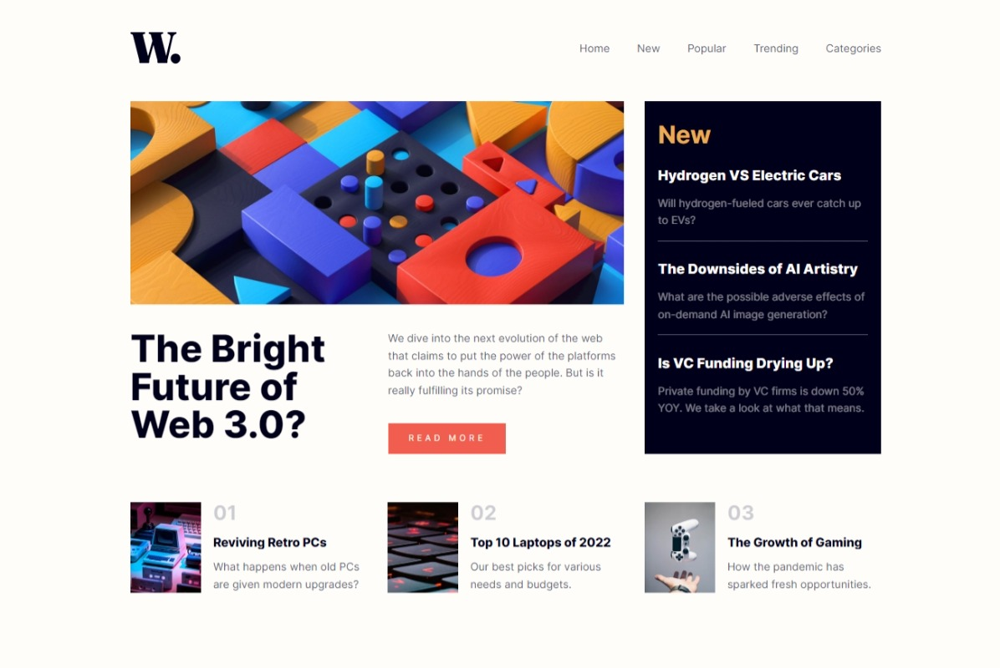
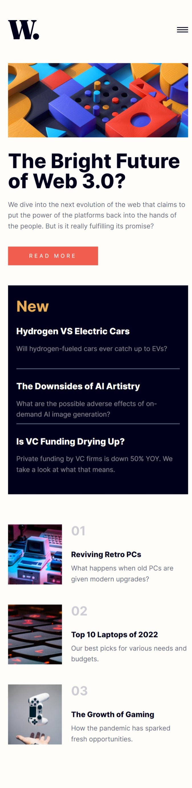

# Frontend Mentor - News homepage solution

This is a solution to the [News homepage challenge on Frontend Mentor](https://www.frontendmentor.io/challenges/news-homepage-H6SWTa1MFl). Frontend Mentor challenges help you improve your coding skills by building realistic projects. 

## Table of contents

- [Overview](#overview)
  - [The challenge](#the-challenge)
  - [Screenshot](#screenshot)
  - [Links](#links)
- [My process](#my-process)
  - [Built with](#built-with)
  - [What I learned](#what-i-learned)
- [Author](#author)
- [Acknowledgments](#acknowledgments)

## Overview

### The challenge

Users should be able to:

- View the optimal layout for the interface depending on their device's screen size
- See hover and focus states for all interactive elements on the page

### Screenshot




### Links

- Solution URL: [My version of News homepage](https://www.frontendmentor.io/solutions/my-version-of-news-homepage-mWWXR-E_Dt)
- Live Site URL: [https://anarenaa.github.io/news-homepage](https://anarenaa.github.io/news-homepage)

## My process

### Built with

- Semantic HTML5 markup
- SCSS
- EM
- CSS Grid
- JS
- BEM

### What I learned

Thanks to this challenge, I learned more about semantics, grid, and began to pay attention to the limitations of text in Google search results. Used this time the SCSS and reset file. Tried to make the font more adaptive using the EM unit.

I am proud of my ```"numbered-list"``` and text limits

```scss
@mixin -webkit-line-clamp($number) {
    -webkit-line-clamp: $number;
    overflow: hidden;
    text-overflow: ellipsis;
    display: -webkit-box;
    -webkit-box-orient: vertical;
}
```

## Author

- Frontend Mentor - [@Anarenaa](https://www.frontendmentor.io/profile/Anarenaa)

## Acknowledgments

Other people's works on the same challenge and comments on them were very useful. Especially regarding semantic.
